# BudgetBuddy – Personal Budgeting App

BudgetBuddy is an Android personal budgeting application developed in Kotlin. The app helps users manage their money by tracking income, expenses, categories, monthly budget goals, reports, and progress towards financial targets.

The project was created for the Open Source Coding / Mobile Development Portfolio of Evidence and demonstrates Android development, local database storage, GitHub version control, automated testing, and GitHub Actions CI/CD.

---

## Project Overview

Managing personal finances can be difficult, especially for students and young adults who need to control spending and monitor saving habits. BudgetBuddy was designed to make budgeting easier by allowing users to record income and expenses, set spending goals, view reports, and unlock simple gamification rewards for good budgeting behaviour.

The app runs locally on Android and stores user data on the device.

---

## App Purpose

The purpose of BudgetBuddy is to help users:

- Track income and expenses
- Categorise spending
- Set minimum and maximum monthly budget goals
- View spending summaries
- Filter expenses by date
- View category-based spending reports
- Monitor budget progress visually
- Stay motivated through badges and rewards

---

## Features

### 1. User Authentication

- Users can register with a username and password.
- Users can log in using their saved details.
- Each user has separate app data.
- Goals, categories, income, expenses, reports, and badges are separated per logged-in user.

### 2. Dashboard

The dashboard displays:

- Logged-in user name
- Current balance
- Monthly budget goals
- Number of categories
- Monthly spending progress
- Progress bar
- Budget status message
- Earned badges
- Recent transactions from the current session

### 3. Categories

Users can:

- Add spending categories
- View saved categories
- Clear categories
- Use categories when adding expenses

Examples of categories:

- Groceries
- Transport
- Entertainment
- Food
- Data
- Rent

### 4. Budget Goals

Users can set:

- Minimum monthly spending goal
- Maximum monthly spending goal

The app uses these goals to show whether the user is:

- Below the minimum goal
- Within the budget range
- Over the maximum goal

### 5. Income and Expense Tracking

Users can add:

- Income
- Expenses
- Expense description/title
- Amount
- Date
- Category
- Optional notes
- Optional receipt image

Expenses are saved locally using RoomDB.

### 6. Receipt Photo Attachment

Users can attach a receipt image to an expense using the Android image picker. The selected receipt image is saved with the expense record as a URI/path.

### 7. Filtering

Users can filter expenses by date range. This allows them to view expenses for a selected period instead of only seeing all entries.

### 8. Reports

The reports screen displays:

- Total income
- Total expenses
- Remaining balance
- Budget goal reference
- Category spending breakdown
- Visual category spending graph

### 9. Local Database Storage

BudgetBuddy uses RoomDB to store expense data locally on the Android device. SharedPreferences are used for user login details, current session data, categories, and budget goal values.

---

## Final POE Features

The following final POE features were added:

### Visual Budget Progress Dashboard

The dashboard includes a visual progress bar showing how much of the maximum monthly budget has been used. It also displays a status message to show whether the user is within their budget range.

### Category Spending Graph

The report screen includes a simple visual graph that displays category spending. This helps users identify which categories they spend the most money on.

### Gamification Badges

BudgetBuddy includes badges to encourage better budgeting behaviour.

Badges include:

- First Expense
- Consistent Logger
- Budget Keeper
- Smart Saver

These badges reward users for logging expenses and staying within their budget goals.

---

## Two Own Features

In addition to the required features, BudgetBuddy includes the following own features:

### 1. User-Specific Data Separation

Each user has their own separate goals, categories, income, expenses, reports, and badges. This prevents one user’s financial data from appearing on another user’s account.

### 2. Receipt Image Attachment

Users can attach a receipt image to an expense. This helps users keep proof of purchases and improves the usefulness of the expense tracking feature.

---

## Technologies Used

- Kotlin
- Android Studio
- XML layouts
- Room Database
- SQLite
- SharedPreferences
- Coroutines
- GitHub
- GitHub Actions
- JUnit testing

---

## Database and Data Persistence

BudgetBuddy uses RoomDB for storing expense records. Each expense includes:

- ID
- User ID
- Title/description
- Amount
- Category
- Type
- Date
- Receipt photo path

User-specific data is handled by saving a user key with each expense. This ensures that each logged-in user only sees their own financial records.

SharedPreferences are used for:

- Login account details
- Current user session
- Budget goal values
- Category lists

---

## GitHub Version Control

GitHub was used to manage the project source code. The repository includes the complete Android Studio project files and commit history.

Version control was used to:

- Save progress regularly
- Track changes
- Collaborate as a team
- Keep a backup of the project
- Submit the source code for assessment

---

## GitHub Actions

GitHub Actions was added to automatically build and test the project when code is pushed to GitHub.

The workflow checks that:

- The project builds successfully
- Unit tests run successfully
- The app can compile outside the developer’s local machine

The latest GitHub Actions workflow run passed successfully.

---

## Automated Testing

Automated tests were added to check important budgeting logic.

The tests cover:

- Balance calculation
- Budget status calculation
- Progress percentage calculation
- Badge unlocking logic

This helps prove that the main calculation logic works correctly.

---

## App Screens

The app includes the following screens:

### Login Screen
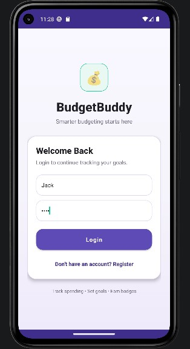

### Register Screen
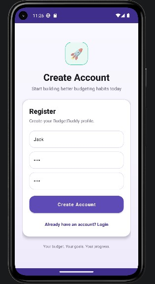

### Dashboard
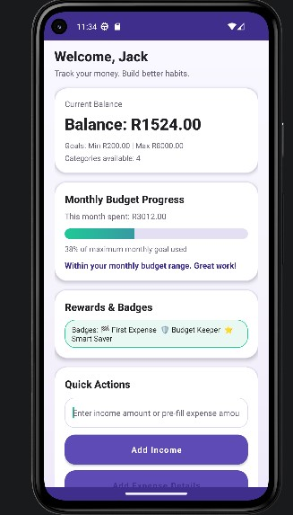

### Dashboard1
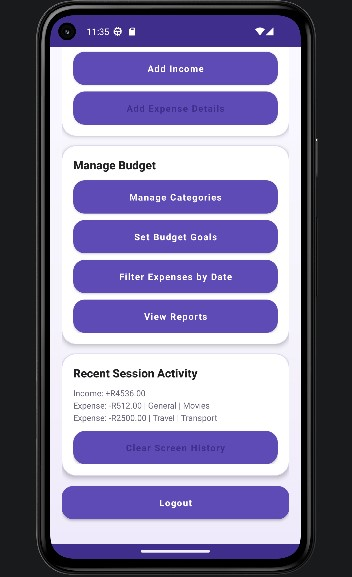

### Add Expense Details
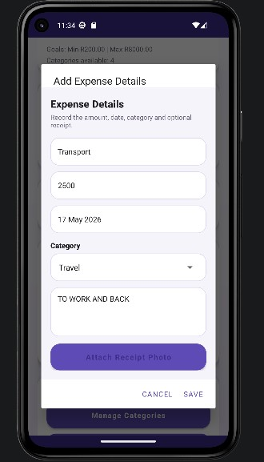

### Categories
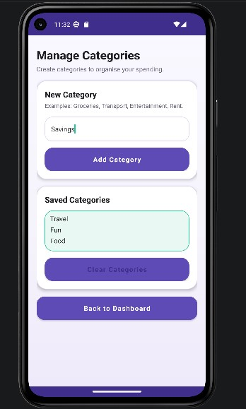

### Budget Goals
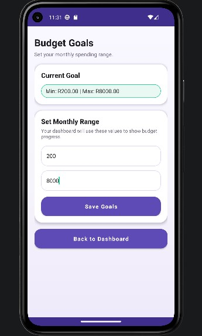

### Reports and Graph
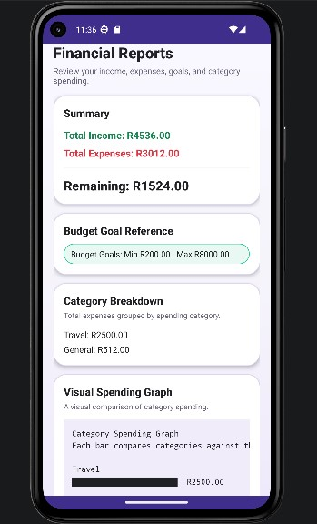

### Reports and Graph1
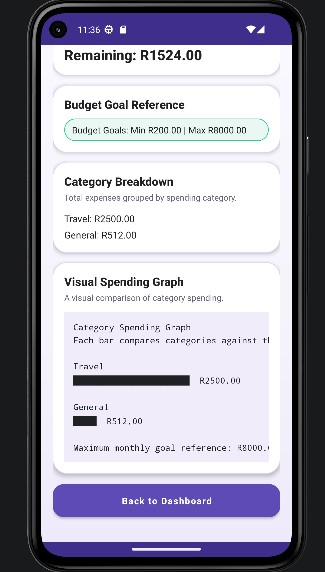

### Filter Expenses
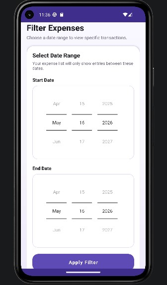

### Filtered Expense1
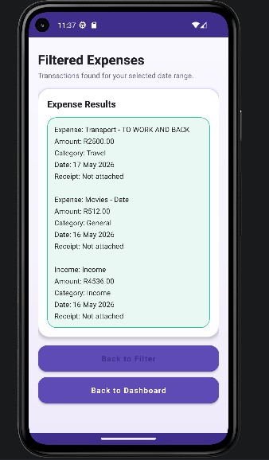

### GitHub Actions

---

## How to Run the App

1. Clone the repository:

```bash
git clone https://github.com/Suhail-Allie/BudgetBuddy-Clean.git
